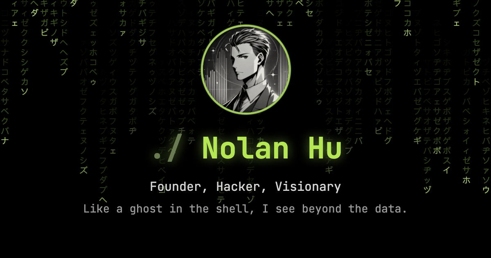

<p align="center">
  
</p>

```console
$ whoami
# founder, hacker, visionary. like a ghost in the shell, I see beyond the data.

$ ls ~/building
sigma-synapses/     # my AI automation agency
dev.nolanhu.com     # a decade of building, written down

$ history | grep before
jpmorgan · hsbc · bny-mellon

$ vmstat --lifetime
tokens_processed   24B+        # AI pipelines, last 12 months
years_shipping     10+         # banks to my own thing
agents_on_call     24/7        # they work while I sleep
```

<!--BLOG:START-->
**`$ tail -2 blog.log`**

- [How I Ship Like a Team of One](https://dev.nolanhu.com/blog/2026/06/26/ship-like-a-team-of-one/)
- [67: How a Repo Named 67hack Won on 6/7](https://dev.nolanhu.com/blog/2026/06/07/67/)
<!--BLOG:END-->

```console
$ tail -1 ops.log
2026-09-09 08:02 UTC · this README rebuilt itself. no humans were involved.

$ uptime
automating the mundane since it first annoyed me█
```

<p align="center">
  <a href="https://dev.nolanhu.com"><code>$ open dev.nolanhu.com</code></a><br>
  <sub><code>./ if you know, you know</code></sub>
</p>
